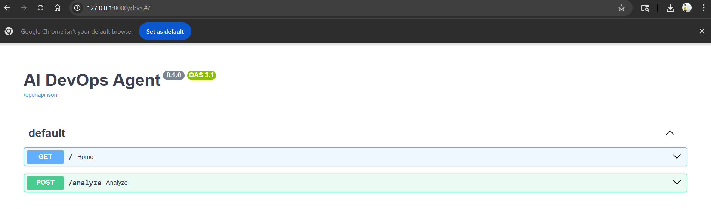
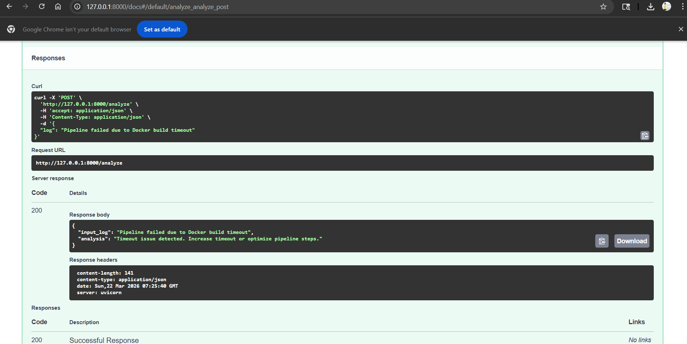

# 🚀 AI DevOps Agent

An AI-powered assistant designed to analyze CI/CD pipeline logs and suggest actionable fixes.

---

## 💡 Problem Statement

Debugging CI/CD pipelines is time-consuming and repetitive.  
Engineers often spend significant time identifying root causes from logs.

This project explores how AI can assist in:
- Faster root cause identification  
- Suggesting fixes  
- Improving developer productivity  

---

## 🔧 Features

- Accepts pipeline logs via API  
- Uses AI to analyze errors  
- Provides:
  - Root cause  
  - Suggested fix  
  - Prevention steps  
- Fallback logic when AI is unavailable  

---

## 🏗️ Architecture

```
User → FastAPI → Pydantic Model → AI Engine → Response
```

---

## 🛠️ Tech Stack

- FastAPI (API layer)  
- Pydantic (data validation)  
- OpenAI API (AI reasoning)  
- Python  

---

## ▶️ How to Run

### 1. Clone the repository

```bash
git clone https://github.com/<your-username>/ai-devops-agent.git
cd ai-devops-agent
```

---

### 2. Install dependencies

```bash
pip install -r requirements.txt
pip install python-dotenv
```

---

### 3. Configure Environment Variables

Create a `.env` file in the root directory and add:

```
OPENAI_API_KEY=your_api_key_here
```

This project uses environment variables for secure API key management.

---

### 4. Run the application

```bash
python -m uvicorn app.main:app --reload
```

---

### 5. Open API Docs

http://127.0.0.1:8000/docs

---

## 🧪 Example Request

```json
{
  "log": "Pipeline failed due to Docker build timeout"
}
```

---

## 📸 Screenshots

### API Endpoint (Swagger UI)



---

### Sample Response



---

> Note: Includes fallback logic when AI API quota is unavailable.

---

## 📈 Future Enhancements

- Integrate with Azure DevOps pipelines  
- Fetch real pipeline logs automatically  
- Deploy on Kubernetes (AKS)  
- Add alerting and automation  

---

## 🙌 Learning Outcome

This project marks my first step into combining AI with DevOps workflows, focusing on practical use cases in SRE and CI/CD.